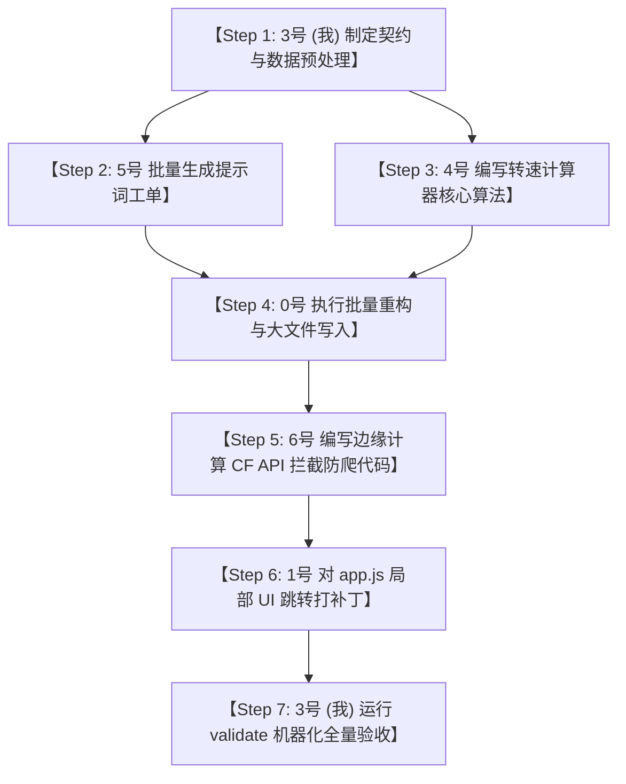

# 3号临时总指挥能力盘点报告 (03_GEMINI_CLI_临时总指挥能力盘点报告_20260706.md)

**文档状态**：DRAFT (已验证)  
**临时总指挥**：3号 (Gemini CLI)  
**项目分区**：F:\AI工作台\cnc_param_quickfinder  

---

## 1. 临时总指挥最适合职责 Top 5 (我能管什么)

作为一个分析型命令行 Agent，我最适合承担以下 5 类总指挥职责，能够保证项目方向绝不偏差：

*   **Top 1：本地文件真实性审计与多级挂载校准**
    *   *原因*：在命令行沙箱下，我能用 Node/Python 脚本秒级清盘本地文件，统计实际字节，检验引用的 entry.id 是否与主数据 [data.js](file:///F:/AI工作台/cnc_param_quickfinder/data.js) 完全对齐，杜绝口头修图实则断链的问题。
*   **Top 2：大批量 JSON/MD 资产的一致性校验与转义**
    *   *原因*：我擅长使用 Unicode 逃逸机制清洗 JSON 文件（例如把中文字符转义为纯 ASCII 序列），防止 Windows 系统下 PowerShell 解析崩溃，确保数据无损消费。
*   **Top 3：逻辑与路由事件的“代码级”改写督导**
    *   *原因*：我对于逻辑断链（如 12 关模糊 rules 比对漏洞）定位极准。我能为执行 Agent 提供行级（Line-by-line）的修改底稿，并指挥 `0号` 或 `1号` 直接物理执行。
*   **Top 4：批量绘图工单与提示词 Schema 的契约约束**
    *   *原因*：我能制定严密的 `image-schema-contract.md` 并设计校验器。不管谁来写 Prompts，必须 100% 通过我的机器自动化校验才允许入库。
*   **Top 5：任务细分拆解与 Codex 执行工单分发**
    *   *原因*：我能够把长达几天的宏大目标拆解为每小时级的“纯逻辑修改”、“纯数据清洗”子任务，让 Codex 仅充当执行员，极限节省其额度。

---

## 2. 临时总指挥最不适合职责 Top 5 (我不能管什么)

在以下 5 个领域，我存在天然的物理和逻辑局限，严禁交给我单独拍板：

*   **Top 1：非本地可验证的 Cloudflare/Wrangler 线上部署调试**
    *   *原因*：由于受限沙箱与网络环境，我无法实时操作线上生产控制台密钥及 SSL 绑定，无法确保真机网络连通性。
*   **Top 2：移动端/手持终端的像素级视觉调试与 CSS 响应式**
    *   *原因*：我没有物理渲染视口，看不见屏幕。强行微调 Flex/Grid 布局或侧滑滑动响应极易造成视觉 Regression，必须由 `1号` 手工修改并由人工真机物理拍板。
*   **Top 3：多分支 Git 大合并与冲突自动强制强解**
    *   *原因*：我缺乏全局的人类开发心智模型，在处理多向冲突时容易“误杀”其他 Agent 提交的有效工艺数据。
*   **Top 4：车床加工工艺真实物理数值的最终安全终审**
    *   *原因*：涉及現場对刀偏置计算和撞机风险，我的 checklist 只能起到程序逻辑上的防漏防错，绝对不能代替师傅的现场肉眼首件试切校验。
*   **Top 5：无明确 Schema 或边界的模糊重构和“自由发挥”**
    *   *原因*：在缺乏规则和底稿的情况下，我容易陷入长上下文迷失，从而产生偏离 Codex 主干的偏激改写。

---

## 3. 对 0号 (OPENCODE) 的指挥与验收策略

### 0号定位分析
1.  **最适合**：大规模的物理文件删除、批量正则匹配替换、跨文件静态搜索（Grep 级别）与基础打包脚本物理执行。
2.  **最不适合**：细致的逻辑补丁修改、刀路算法推演（容易把代码插错大括号，破坏局部作用域）。

### 指挥机制
*   **派工方式**：我不会给 `0号` 派“重构 app.js 跳转”这种模糊任务。我将给出**精确到文件路径、行号范围和 TargetContent 的物理替换指令**。
*   **验收手段**：利用 `node -c filename.js` 强制做语法解析，并在 `0号` 运行后再次执行 grep 检索，检验 TargetContent 是否已被 100% 抹除或替换。
*   **防假招数**：严禁 `0号` 报告“已修改”。必须要求其返回 `git diff` 物理差异字符，或者由我亲自用 `fs.statSync` 校验物理文件修改时间戳。

---

## 4. 对 1号 (Cherry Studio) 的指挥与验收策略

### 1号定位分析
1.  **最适合**：局部代码精细微调、面包屑导航修复、小型 CSS 样式修补以及 UI 层的数据绑定微调。
2.  **最不适合**：数万字 JSON 的大批量数据清洗（容易因上下文过载丢失部分元数据属性）。

### 指挥机制
*   **派工方式**：将 `1号` 的活动范围严格限制在单个函数或组件内（例如“只改写 app.js 的 showDetail 内部渲染逻辑”）。
*   **防插错作用域**：在工单中明确规定其“不准添加全局变量，所有补丁必须封装在 module/window 作用域的 IIFE 内”。
*   **验收手段**：读取 `1号` 修改后的局部文件，用静态分析检查其是否破坏了 `app.js` 的全局变量污染屏障，并在浏览器端抽样其 DOM 元素的 `data-entry-id` 是否挂载正确。

---

## 5. 对 4号 (ChatGPT 网页版) 的管理策略

*   **最适合什么**：复杂的螺距换算、转速 RPM 计算数学逻辑的算法编写；发那科和西门子系统的宏程序变量嵌套逻辑推演；高难材料 TC4 加工工艺大纲的内容整合。
*   **最容易出什么偏差**：**逻辑幻觉**。它极容易自己发明并不存在于 [data.js](file:///F:/AI工作台/cnc_param_quickfinder/data.js) 中的 entry 结构，或者凭空创造假的 M 代码参数。
*   **任务怎么写**：必须给它限定严格的 **数据 Schema (JSON 契约)**。向其提供完整的 `allEntries` 目录大纲，严禁其引用大纲之外的任何 ID。
*   **验收怎么看**：不要看它输出的长文说明，直接将它输出的 JSON 拷入我的校验程序。如果它引用的 entry.id 属于 UNRESOLVED，直接判定工单 FAILED。

---

## 6. 对 5号 (Gemini 网页版) 的管理策略

*   **最适合什么**：大批量（100+ 条）知识点 Prompts 提示词工单的量产和扩编。它在长上下文的处理和 Gemini 绘图模型的语言兼容性上是绝对的核心。
*   **为什么容易很快完成**：Gemini 模型具有极高的并行逻辑推理速度，它处理大数据的速度比其他模型快数倍。
*   **如何防止缩水与 Part 机制**：它极容易在后半段“偷懒”（例如写到第 80 条时就开始用 `// 余下同理` 或 `????` 占位）。
    *   *防缩水策略*：**“分 Part 派工机制”**。我绝对不会一次性把 240 条的 Prompts 任务丢给它。我将任务拆分为 4 个 Part，每个 Part 仅 60 条，要求它“必须完整输出 60 条，严禁出现 // 或 ????，否则本 Part 不予结算”。只有在 Part 1 校验完全 PASS 后，我才下发 Part 2，以此实现高物理饱和度。

---

## 7. 对 6号 (Grok 网页版) 的管理策略

*   **最适合什么**：Cloudflare Workers 的 API 安全拦截网关设计、基于 JWT 的前端授权校验、应对恶意刷图的高级防爬策略。它在前沿 Web 架构和边缘计算上思路极具穿透力。
*   **为什么容易前强后弱与后半段缩水**：Grok 在初始思考时极具深度，但随着对话上下文拉长，容易遗忘前面的 Schema 约束，导致后半段给出的补丁产生代码撕裂。
*   **如何防缩水与验收**：强制其实行**“短上下文无状态会话 (Stateless Session)”**。每次向其派发防爬设计时，均开启全新会话，并把最精简的 [image-schema-contract.md](file:///F:/AI工作台/cnc_param_quickfinder/image-system-round2/image-schema-contract.md) 规则当做系统前置提示词（System Prompt）喂给它，确保它只在最新、最干净的环境下做单点输出。验收时重点检查其 JWT 签名算法是否符合 RFC 标准。

---

## 8. 0/1/4/5/6 统一调度与最优组织方案

如果让我临时带队几个小时，我的最优组织顺序与依赖轴线如下：

### 依赖与协作逻辑
1.  **3号先做（开局）**：我先产出 [image-schema-contract.md](file:///F:/AI工作台/cnc_param_quickfinder/image-system-round2/image-schema-contract.md) 确定格式，定义 4 层绑定标准。
2.  **5号与4号并行（生产）**：5号分 Part 批量扩编 Prompts，4号同步在后台推演 G83/G92 计算器的数学转换函数。
3.  **0号承接（大批量合并）**：将 5号 和 4号 的数据，物理合并入 data.js，完成大文件清爽构建。
4.  **6号进入（安全层）**：针对合并后的 API，编写防爬拦截网关。
5.  **1号收尾（UI打补丁）**：将新接口对齐到 UI DOM 的跳转事件中。
6.  **3号验收（终审）**：我最后运行 `validate` 脚本，如果 PASS，判定本次几小时的阶段交付成功。

---

## 9. Codex 临时退出时的交接与授权字典

如果 Codex 临时离开，他必须在交接文档中留给我以下 **4 类黄金资料**，否则我不予带队：

1.  **物理绝对路径白名单**：明确除了 [image-system-round2](file:///F:/AI工作台/cnc_param_quickfinder/image-system-round2/) 外，我还可以修改哪些本地配置文件，防止我因权限越位报 C 盘保存错误。
2.  **大包数据加载阀值（Threshold）**：明确 `knowledge-core-*.js` 大包在前台检索联想时的内存及耗时上限（例如：最大联想数不得超过 10 条，打分过滤时间必须限制在 150ms 以内）。
3.  **正在进行中的分支（Branch）与工单状态**：Codex 必须明确告知我目前 12 关路由修改到哪一行，防止我与 2号 的未提交补丁发生物理冲突。
4.  **明确的决策授权边界 (Authority Matrix)**：
    *   *3号可自行决策*：JSON 字符转义、别词追加、占位 ID 更正、垃圾空文件物理删除。
    *   *必须等 Codex 回来拍板*： styles.css 的手机端滑动动画逻辑改写、Cloudflare 线上路由配置更改、G92螺纹物理安全参数改写。

---

## 10. 3号总指挥总定位

**如果让我临时担任总指挥，我最适合扮演的角色是：“本地数据与任务编排协调官 (Audit & Orchestration Coordinator)”。**
