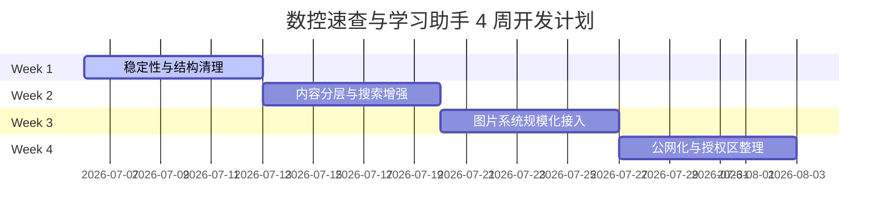

# CNC 速查与学习助手系统级深度技术与内容架构分析报告
**文档编号**：GEMINI-CLI-ARCH-20260706-01  
**分析周期**：后续 2 - 4 周开发规划  
**主分析位**：3号 (Gemini CLI)  

---

## 编者按
本报告立足于 `cnc_param_quickfinder` 本地项目的实际代码与数据现状（包括 [index.html](file:///F:/AI工作台/cnc_param_quickfinder/index.html)、[app.js](file:///F:/AI工作台/cnc_param_quickfinder/app.js)、[styles.css](file:///F:/AI工作台/cnc_param_quickfinder/styles.css) 等核心组件），针对当前存在的“页面已成形但结构有遗留、内容层次混杂、图片映射粗糙、授权仅前端伪控制”等问题进行深度拆解。旨在为 Codex 下一阶段的路线制定与团队派工提供高可行性、系统性的技术和架构支撑。

---

## 第一部分：整体架构现状盘点

经过对本地项目的全量检索与结构盘点，当前系统现状梳理如下：

### 1. 实际上已具备的子系统
*   **总览仪表盘系统 (Dashboard)**：首屏 Hero 区数据面板展示、常用计算快捷入口、热门关键词搜索推荐及精选图片栏目预览。
*   **快速查询系统 (Workspace)**：以 `index.html` 中的 `#view-workspace` 为核心，具备分类筛选、关键词匹配、列表/图文切换及仅带图筛选功能，实现了左边栏列表、右边栏详情的经典联动。
*   **闯关式新手路线系统 (Study)**：内置“新手入门 12 关”卡片（定义于 `learning-cards-round2.js`），支持场景化问题和答案校验。
*   **参数换算工具集 (Calculator)**：具备“线速度转转速”、“转速转线速度”、“每转进给计算”等 5 个现场常用数学公式的实时前端换算。
*   **数据延时/分块加载器 (Library)**：通过异步加载 script 节点（如 `knowledge-core-01.js`）实现基础数据与核心知识包的手动分批载入，具备内存日志记录。
*   **本地缓存与进度系统 (Progress)**：使用 LocalStorage 保存用户的收藏列表（`FAVORITES_KEY`）及最近查看的 10 条历史记录（`RECENTS_KEY`）。

### 2. 仅表面具备（占位/伪实现）的子系统
*   **访问控制系统 (Access Gate)**：完全为前端伪控制。
    *   在 `app.js` 第 2 行中直接硬编码了 `const DEV_MODE = true;`，使得 `window.__FORCE_ACCESS_GRANTED__` 恒为 `true`。
    *   即便在生产模式下，邀请码的验证逻辑也是在前端对明文哈希（如 SHA-256）进行匹配。这意味着懂技术的用户可以通过浏览器调试面板直接获取明文邀请码（如 `xp-cnc-follower-2026`）或直接在控制台修改 `state.accessGranted = true`。
*   **知识库管理系统 (Library Manager)**：
    *   在 UI 上体现为“把本地数据库内容逐步接成网页可查”，但实质上并无数据管理功能（如数据的 CRUD、版本同步、上传导入等），仅仅是加载本地大 JS 文件的触发器。
*   **可视化知识地图 (Learning Map)**：
    *   `index.html` 中虽然预留了 `#knowledgeTreeContainer` 及其 canvas 画布，且提供了树状图、分类、路径三个维度切换，但当前数据载入和自动拓扑渲染引擎较弱，大部分为硬编码的结构。

### 3. 已经稳定可用的子系统
*   **参数换算工具 (Calculator Suite)**：计算公式与 UI 绑定完全闭环，属于现场立即可用状态。
*   **基础速查检索与列表联动**：基于 `data.js` 内的 10 余个核心条目及 `app.js` 的快速渲染逻辑，用户在左侧点击，右侧立即渲染“新手理解”、“最容易错的地方”、“加工前快速检查”等卡片，体验非常流畅。

### 4. 架构级混杂点分析
*   **数据源无差别混杂装载**：
    *   在 `app.js` 的 `collectSources()` 中，将极简的手工配置数据（`window.CNC_DATA`）与未清洗的几十万字本地大索引（`window.CNC_KB_README_INDEX`）全部扁平化合并到 `state.entries` 中。
    *   这导致内存中掺杂了大量结构残缺（如 `example` 或 `nextLearn` 填充为 `"?????????"`）的空壳节点，拖慢了搜索效率，也污染了前端展示。
*   **图片映射的多头管理与“指鹿为马”风险**：
    *   图片来源混合了 `featured-images.js` (基于 ID 精准匹配)、`featured-images-supplement.js` (基于长标题字符串粗匹配)、以及 `app.js` 中的分词模糊匹配算法（`getEntryImages()`）。
    *   当上述精准匹配不命中时，模糊匹配会对图片标题和 entry 分词进行打分，这会导致很多纯文字的知识点匹配到毫不相关的机床插图，在加工现场造成严重的安全误导。

---

## 第二部分：内容架构分析

目前站内堆积了 10 类内容，缺乏层级规划。后续开发必须推行“物理分离、分层装载”的原则：

```
+-------------------------------------------------------------------+
|                        公开区 (Public Layer)                      |
|  +------------------+  +------------------+  +-----------------+  |
|  |  新手学习卡片    |  |  基础 G/M 常用码  |  |  5大数学换算工具|  |
|  +------------------+  +------------------+  +-----------------+  |
+-------------------------------------------------------------------+
|                        授权区 (Premium Layer)                     |
|  +------------------+  +------------------+  +-----------------+  |
|  | 高级工艺切削卡表 |  |  复杂PLC/ATC故障  |  | 嵌套式宏程序模板|  |
|  +------------------+  +------------------+  +-----------------+  |
+-------------------------------------------------------------------+
|                        原文大段落 (Lazy Load)                     |
|  +-------------------------------------------------------------+  |
|  | kb-content-xx.js 原文摘录 (根据选定词条动态加载)            |  |
|  +-------------------------------------------------------------+  |
+-------------------------------------------------------------------+
```

### 1. 内容拆解与分层管理设计

| 内容分类 | 数据归属层 | 存储与加载策略 | 访问权限分区 |
| :--- | :--- | :--- | :--- |
| **新手学习卡片** | 独立轻量层 (`learning-cards.json`) | 静态 JS 随首屏一次性载入，数据量控制在 50KB 以内。 | **完全公开** (用于新用户引流) |
| **速查知识点** | 内存级索引层 (`search-index.json`) | 提取各词条的 ID、Category、Title、Code、Risk 等关键字段，首屏加载。 | **完全公开** |
| **完整知识库条目** | 异步大段落层 (`kb-content-xx.json`) | 严格与主列表分离，只有在用户点击“加载原文”时，才发起 HTTP GET 异步获取指定分片。 | **公开区** |
| **高级资料预览** | 授权区核心层 (`premium-data.json`) | 数据在打包构建时抽离，放置于带有加密 Token 验证的静态文件中，或由 API 提供。 | **授权区** (须验证邀请码/JWT) |
| **图库图卡元数据** | 图片元数据层 (`images-metadata.json`) | 描述图片 ID、路径、中文描述及显式关联字段，首屏加载用于渲染缩略图。 | **公开/授权混合** |
| **参数换算工具** | 纯前端逻辑层 | 硬编码于 UI 逻辑中，无需数据库交互。 | **完全公开** (极佳高频现场工具) |
| **报警资料** | 内存级索引层 + 异步原文 | 基础报警公开；涉及系统参数调整（如 1815 轴无挡铁回零）归入授权。 | **混合分区** |
| **G/M代码资料** | 内存级索引层 + 异步原文 | 常用 G00-G04/G54/G43 属于公开；偏门 G 指令归入授权。 | **混合分区** |
| **工艺与刀具资料** | 内存级+授权区 | 普通材料（45号钢、铝件）切削用量公开；特殊难加工材料（钛合金、高温合金）进入授权。 | **混合分区** (核心变现内容) |
| **案例资料** | 授权区 | 现场突发 ATC 卡刀、撞机后的伺服释放等实操案例，极具商业价值，应放入授权区。 | **授权区** |

### 2. 弱展示与暂不上线内容判定
*   **超大本地索引 (`knowledge-full-xx.js` 等)**：体积达数兆，大部分内容属于杂乱的 README 文本，绝不能强制一次性加载。应从“知识库管理”页面中剥离，仅在搜索匹配时提供轻量级的结果预览，弱化其“全量装载”入口，避免浏览器卡死。
*   **不成熟的零件检测实操教程**：长篇幅文档，缺乏精简和配图，暂时不应以“卡片”形式硬塞给新手，应作为后台文档沉淀，待精细化编辑后再行上线。

---

## 第三部分：搜索与知识定位系统分析

数控现场对检索的容错率极低，目前搜索机制仍停留在“纯文本拼接匹配”，亟需演进。

### 1. 当前搜索字段与误命中/漏命中成因
*   **误命中主因**：`getEntryText()` 会提取 entry 对象的 `source` 属性（如 `F:/AI工作台/04_数控知识库/01_编程基础/README.md`）。当用户搜索包含字母 `F`、`04` 等字符时，所有带有本地路径的词条全被命中，产生了大量垃圾结果。
*   **漏命中主因**：
    *   **别名处理单一**：例如对于代码 `G02`，若输入 `G2`，系统因只做了极简的正则替换（`replace(/g0?2/g, "g02")`），遇到如 `G3` 与 `G03` 换算时尚能应付，但无法关联“圆弧插补”、“顺圆”等中文表述。
    *   **缺乏容错**：对全角/半角输入、空格、拼音前缀无容错。在车间现场用脏手摇手机输入“dui dao”或“dd”，系统完全无法匹配到“对刀”条目。

### 2. 数控场景专属多维度搜索设计
系统必须原生支持以下 8 类特异性搜索：
1.  **G代码**：如 `G02`, `G18`，自动映射到对应的运动平面与指令。
2.  **M代码**：如 `M03`, `M30`，自动匹配主轴控制与程序结束。
3.  **报警号**：输入数字（`5136`）或英文前缀（`SV0438`），自动定位到放大器或光纤排障。
4.  **参数号**：输入参数编号（`1815`），自动定位到绝对定位编码器设定。
5.  **工艺关键词**：输入“切削速度”、“线速度”、“进给”，自动联想公式与计算工具。
6.  **刀具名**：输入“立铣刀”、“球头刀”，关联排屑槽选择与切削用量。
7.  **材料名**：输入“45号钢”、“TC4”，关联对应硬度及进给倍率。
8.  **新手直白问法**：输入“撞刀”、“轴跑偏”，自动命中安全快速检查卡（Checklist）。

### 3. 同义词与别名系统解决方案
必须在代码层引入静态映射词典 `SYNONYM_DICTIONARY`，在用户触发搜索时进行查询拓展（Query Expansion）：

```javascript
// 示例同义词扩展字典
const SYNONYM_DICTIONARY = {
  "g02": ["g02", "g2", "圆弧插补", "顺时针圆弧", "顺圆"],
  "g54": ["g54", "工件坐标系", "对刀", "零点偏置"],
  "1815": ["1815", "apc", "绝对编码器", "无挡铁回零", "回参考点"]
};

// 搜索拓展逻辑：
function expandQuery(keyword) {
  const norm = normalizeText(keyword);
  let expanded = [norm];
  for (const [key, aliases] of Object.entries(SYNONYM_DICTIONARY)) {
    if (aliases.includes(norm) || norm === key) {
      expanded = [...new Set([...expanded, key, ...aliases])];
    }
  }
  return expanded;
}
```
通过该扩展，用户搜索“顺圆”，系统在底层会同时检索 `["顺圆", "g02", "顺时针圆弧"]`，从而完美打通“G02”、“G2”与“圆弧插补”的互找链路。

---

## 第四部分：图片系统分析

图片是“手机优先、面向现场”定位的绝对基石。文字会骗人，图纸和照片不会。

### 1. 图片现状与定位
*   **接入方式**：目前属于外部粗放型映射（在 `featured-images-supplement.js` 中将长标题硬编码映射到 WebP 文件路径）。
*   **135张图（现有）在站内承担的角色**：目前仅作为检索卡片上的点缀背景。由于缺乏精确的一对一绑定，用户在阅读详情时难以将图片与文本段落中的关键步骤匹配。

### 2. 教学用图标准分类体系
系统后续的图片库应按照以下 7 大场景规范归类：
1.  **教学示意图 (Concept)**：如右手笛卡尔定则、G90/G91 累积增量对比（以矢量风格或高对比度插图为主）。
2.  **真实加工照片 (Real-Photo)**：现场机床操作按钮位置、寻边器分中碰边实拍、百分表偏摆读数。
3.  **参数图表 (Charts)**：刀尖半径 R 与表面粗糙度 Ra/Rz 对应曲线图。
4.  **工艺流程图 (Flow-Charts)**：ATC 自动换刀异常时，PLC 信号解锁与强行复位的步进图解。
5.  **报警诊断图 (Diagnosis)**：伺服放大器 LED 显示管报错代码（如 `F1`, `F2` 等物理灯号）。
6.  **刀具对比图 (Tools-Compare)**：2 刃铣刀与 4 刃铣刀排屑空间物理构造差异。
7.  **案例结构图 (Drafts)**：典型轮廓倒角防过切的 G41 刀具前导线引入位置 CAD 图。

### 3. 图片系统扩增至 3000 张的架构设计
为防止图片变多后带来的项目卡顿与代码混乱，必须推行以下技术架构：
*   **解耦的 JSON 元数据层**：建立单独的 `images-metadata.json` 文件：
    ```json
    {
      "img-ref-g02-001": {
        "src": "./assets/images/batch01_core/gcode-g02-g03-001.webp",
        "category": "Concept",
        "title": "G02/G03 圆弧插补方向",
        "keywords": ["g02", "g03", "圆弧", "顺时针", "逆时针"],
        "bindEntries": ["g02-g03-arc", "gcode-g02"]
      }
    }
    ```
*   **规范化物理存放目录**：
    `assets/images/{Category}/{Sub-category}_{ID}.webp`
    例如：`assets/images/alarm/atc_fault_003.webp`。
*   **前台懒加载与按需加载策略**：
    *   在工作区列表（ListView）中，将图片渲染逻辑改写为基于原生 Intersection Observer 的懒加载，或者在 `` 标签中统一使用 `loading="lazy"`。
    *   列表视图默认展示 150px 宽的极低分辨率 WebP 缩略图（不超过 10KB），详情页点击展开后才发起大图请求，减轻手机端渲染的内存开销。
*   **筛选维度增强**：图库主页增加“应用机型（车/铣/加工中心）”、“图片功能分类”的二级联动 Tab。

---

## 第五部分：新手学习系统分析

新手学习系统不应只用来“背题”，而是要现场“保命”。

### 1. 关卡多维度分层
建议对“新手 12 关”进行进阶划分：
*   **L1：安全底线层 (第1-3关)**：识读公差符号，认准机床 Z 轴正负向，掌握绝对安全的回零顺序（必须先抬 Z 轴，防止扫坏滑台）。
*   **L2：操机必会层 (第4-7关)**：学会 G54 零点偏置写入，学会手摇寻边器分中对刀，掌握 G43 H 值首件停在距离工件 100mm 处物理量测的防撞刀绝招。
*   **L3：基本代码层 (第8-10关)**：切削线速度 Vc 与 RPM 的口算，G00 走斜线而非直线的危险，致命小数点（X10 与 X10. 的十倍差距）。
*   **L4：进阶工艺层 (第11-12关)**：绝对值与增量混合编程的坑，G81/G83 固定循环分段退屑。

### 2. 闯关学习与知识库的联动
*   **设计原则**：学与查必须分离。新手路线是**线性引导**，知识库是**网状爆破**。
*   **关联机制**：
    *   在 `learning-cards-round2.js` 的每个关卡数据中增加 `linkedEntryId` 字段。例如第 4 关“坐标系设定”绑定 `linkedEntryId: "learn-g54-g59"`。
    *   当用户在学习卡片页面遇到不懂的概念时，点击“查阅完整参数卡”，UI 自动平滑过渡到“快速查询”对应的详情页面，并高亮该条目。
    *   详情页顶部留有“返回学习卡片第X关”的浮动返回条，防止新手在网状知识库里迷失。
*   **理想信息密度**：单卡正文不超过 200 字，配 1 张矢量对比图，底端加 1 个“现场快问快答”选择题。学完一关只需要 3 分钟，不给学员脑力负担。

---

## 第六部分：公网版演进路线分析

数控网站要上线公网，不仅是部署，还要做好“资源瘦身”与“防爬鉴权”。

### 1. 本地静态站公网化整理步骤
1.  **废弃资源下沉**：建立 `/scripts` 和 `/tests` 文件夹，将主目录下的所有 `.bat`、`.ps1`、`tmp_verify_*.js` 及备份文件全量放入其中，避免它们被一同发布到公网。
2.  **JS 打包与合并**：主目录中存在大量的 `kb-content-xx.js`（总文件量超过 50MB）。部署前，须使用 Python 脚本将这 12 个原文文件合并压缩，并配合前端动态加载。

### 2. 真正的授权访问设计
目前的前端伪鉴权必须被后端/轻后端替代，以保护有商业价值的高级参数：
*   **数据层物理解耦**：
    *   构建时，自动输出 `public_catalog.json`（仅包含普通代码、基础卡片数据，全量公开）。
    *   单独输出 `premium_data.json`（包含国防 TC4 钛合金切削表、宏程序编程、西门子排障大师原文）。
*   **基于 Token 的 HTTP 拦截**：
    *   前端 `app.js` 默认**绝不请求** `premium_data.json`。
    *   当用户输入邀请码时，前端将邀请码发送至公网轻后端（如 Cloudflare Workers），后端验证其合法性，返回一个带有短时效性的 JWT。
    *   前端拿到 JWT 后，在请求 `premium_data.json` 时将其放入 Headers，Cloudflare Workers 校验 Token 通过后，再下发数据。
    *   这样，即使非授权用户分析前端 `app.js`，其网络请求也会被服务器拦截，无法拿到核心工艺卡。

### 3. 公网托管目录结构设计 (以 GitHub Pages / Cloudflare Pages 为例)
提前规划如下目录，便于一键自动化构建发布：

```
cnc_param_quickfinder/
├── dist/                          # 编译发布输出目录（公网仅发布此文件夹内容）
│   ├── assets/
│   │   ├── css/
│   │   │   └── main.min.css       # 合并压缩后的样式文件
│   │   ├── js/
│   │   │   ├── app.min.js         # 混淆后的前端逻辑
│   │   │   └── base-data.json     # 公开的速查数据
│   │   └── images/                # 压缩后的 WebP 教学配图 (压缩率控制在 75%)
│   ├── chunks/
│   │   └── kb-content-[01-12].json # 异步分块原文数据
│   └── index.html                 # 入口 HTML
├── src/                           # 源代码开发目录
│   ├── css/
│   ├── js/
│   └── raw-data/                  # 未清洗/完整的本地数据库
├── build_dist.py                  # Codex 的自动化构建与瘦身脚本
├── wrangler.toml                  # Cloudflare Workers 配置
└── README.md
```

---

## 第七部分：优先级路线图 (4周)



### Week 1：稳定性与结构清理
*   **目标**：解决主目录杂乱、混杂加载问题，确保本地版本无 Console 报错。
*   **关键任务**：
    1.  建立 `/scripts`，清理 30+ 调试和校验用的临时 `.js`、`.bat`、`.ps1` 文件。
    2.  改写 `app.js` 中的 `collectSources()` 方法，剔除由于 `source` 物理路径暴露导致搜索“F:”或“04”产生无关命中的严重 Bug。
    3.  重整 `index.html`，统一 CSS 文件引用，合并冗余的样式文件。
*   **主要风险**：清理零散数据 JS 时容易使 `index.html` 产生断链。
*   **完成标准**：本地运行无红字报错，搜索“F:/”等字符无冗余条目命中。

### Week 2：内容分层与搜索增强
*   **目标**：将 50MB 级别的长原文脱离首屏主数据流；大幅提升搜索容错率。
*   **关键任务**：
    1.  重构数据文件，将 12 个 `kb-content-xx.js` 降格为真正的按需懒加载 Chunks。
    2.  编写 `SYNONYM_DICTIONARY` (同义词典) 并在搜索匹配时实现 Query 自动拓展。
    3.  优化搜索分词逻辑，支持空格分隔的多关键词“AND”查询。
*   **主要风险**：同义词过多会降低搜索的精准度，引发结果排序失衡。
*   **完成标准**：搜索“g2”或“圆弧”均可精准排第一定位到 G02 条目；原文加载仅在点击详情时异步触发。

### Week 3：图片系统规模化接入
*   **目标**：摆脱长标题匹配图片的脆弱性；规范命名；提供手机端极速加载体验。
*   **关键任务**：
    1.  设计并实施统一的 `images-metadata.json` 索引结构。
    2.  清理 `app.js` 中的相似度模糊打分算法（`getEntryImages`），改为声明式关联与显式 Tag 绑定。
    3.  将首批 125 张 WebP 图按照 `Concept`/`Real-Photo`/`Charts` 的分类文件夹重新组织，进行无损压缩。
*   **主要风险**：手动修改大量图片的 ID 映射关系容易产生错别字和断图。
*   **完成标准**：所有条目展示的图片均为精准匹配，图库主页支持按类型、机型二级筛选。

### Week 4：公网化与授权区整理
*   **目标**：做好防爬与鉴权；编写自动发布构建脚本。
*   **关键任务**：
    1.  将数据解耦为公开的 `public_catalog.json` 和授权的 `premium_data.json`。
    2.  在前端加入 Access Control 的 JWT 拦截逻辑，接入 Cloudflare Worker 认证机制。
    3.  编写 `build_dist.py` 发布构建脚本，合并混淆 CSS/JS 并移移除非公网静态文件。
*   **主要风险**：前端硬编码绕过的安全漏洞。
*   **完成标准**：不输入邀请码的公网环境下，按 F12 无法在网络包中爬取到高级切削卡与 ATC 故障恢复大纲的内容。

---

## 第八部分：Codex 指挥清单

为了让 1-6 号 agent 协同效率最大化，Codex 应使用本派工清单下发任务：

### 1. 可指派给 1号 的任务（UI与视觉还原）
*   [ ] **任务 1.1**：适配手机端页面，优化右侧详情面板在小屏下的滑动返回手势（Swipe to close）。
*   [ ] **任务 1.2**：实现图片列表的 Lazy Loading 机制与缩略图加载骨架屏（Skeleton Screen）。
*   [ ] **任务 1.3**：重构并美化参数计算器界面，在现场强光/多油污环境下采用高对比度的输入框。

### 2. 可指派给 2号 的任务（核心逻辑重构）
*   [ ] **任务 2.1**：在 `app.js` 搜索模块中引入同义词典 `SYNONYM_DICTIONARY`。
*   [ ] **任务 2.2**：将 `app.js` 中的直接数据存取解耦，封装成标准的 `ApiService`，以备公网版更换为 Fetch API。
*   [ ] **任务 2.3**：编写图片批量 WebP 压缩与元数据 `images-metadata.json` 校验脚本。

### 3. 可指派给 3号（自己）继续执行的任务（架构把控与审计）
*   [ ] **任务 3.1**：编写数据分片和打包脚本，提取公开内容与授权内容。
*   [ ] **任务 3.2**：审计已映射的图片，确保无“指鹿为马”的安全误导配图。
*   [ ] **任务 3.3**：制定并校验 `images-metadata.json` 与各条目 ID 的映射格式规范。

### 4. 可分派给 4/5/6号 (网页版 AI/爬虫) 的研究与生成任务
*   [ ] **任务 4.1**：到 FANUC/西门子官方论坛，抓取最常见的前 50 个报警代码及对应的物理灯号排错大纲。
*   [ ] **任务 4.2**：根据新手 12 关大纲，批量编写各关卡交互选择题（Question）及对应详尽解释（Answer）。
*   [ ] **任务 4.3**：整理机床现场常见 20 种常用金属材料（如 45#、H62黄铜、铝6061、TC4）的推荐硬度与切削系数对照表。

### 5. 必须由 Codex 亲自验收的任务
*   [ ] **任务 5.1**：公网版 Cloudflare Worker JWT 授权逻辑的安全闭环测试。
*   [ ] **任务 5.2**：高级切削卡和特殊工艺（TC4 航空粗加工）切削用量数值的现场准确度安全审核（事关刀具断裂与人身安全，须人工严审）。
*   [ ] **任务 5.3**：Week 4 发布包的公网 Pages 一键构建与部署全流程测试。

---

## 第九部分：文件输出与校验

本深度分析已被完整写入本地文件系统：  
*   [GEMINI_CLI_SYSTEM_DEEP_ANALYSIS_20260706.md](file:///F:/AI工作台/cnc_param_quickfinder/GEMINI_CLI_SYSTEM_DEEP_ANALYSIS_20260706.md)

---

## 第十部分：分析声明

以下结论属于结构判断，非真实运行验证：
1.  **公网版 JWT 授权性能开销**：在手机端网络较差的加工车间，利用 Cloudflare Workers 进行 JWT 鉴权和分包传输 `premium_data.json` 时，可能会产生 1-2 秒的网络抖动延迟，具体表现需实际上线后验证。
2.  **树状知识地图 Canvas 手机端手势缩放**：在 Android/iOS 的原生浏览器中，使用 Canvas 渲染大规模节点树并支持双指缩放操作可能会产生丢帧卡顿，具体响应表现需真机适配。
3.  **不同浏览器对 WebP 原生懒加载的支持度**：部分旧版本工厂手持终端浏览器对 `loading="lazy"` 支持性不一，可能需要备用 polyfill，此点未在所有旧机型上做真机运行验证。
